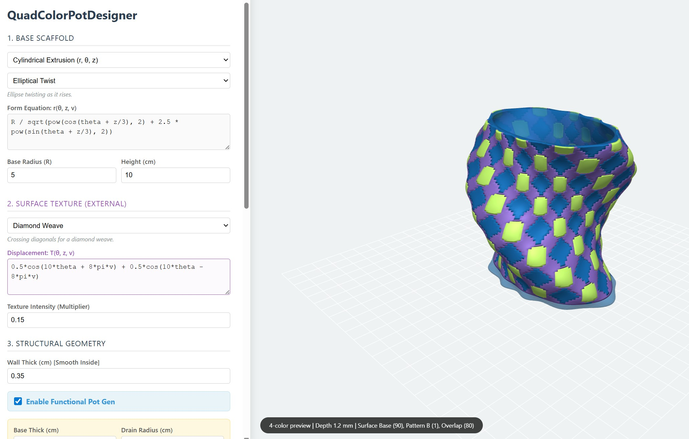

# Equation-Driven Pots

[**Open the online tools**](https://arkadiraf.github.io/Equation-Driven-Pots-App/)

**Equation-Driven Pots** is a design project for generating functional, 3D-printable plant pots from mathematical equations.

Instead of sculpting a vessel manually, the project defines form through radius fields such as:

- `r(z, θ)` for cylindrical workflows
- `r(θ, φ)` for spherical workflows

where:

- `z` is vertical height
- `θ` is the angle around the form
- `φ` is the polar angle in spherical coordinates
- `r` is the radius at that point

By changing the math, the tools can produce printable vessels that are smooth, ribbed, lobed, twisted, patterned, textured, or highly experimental.

---

## Project focus

This repository now centers on the HTML / JavaScript tools.

The Python scripts remain important as the basis of the project and as the foundation for the Fusion 360 sweep workflow, but the main user-facing experience is now the browser-based designers.

---

## How it works

At the core, the tools sample a user-defined equation over a grid and convert the result into printable geometry.

Depending on the workflow, the generated object may include:

- an outer shell
- an inner shell
- a base or bottom surface
- drainage openings
- texture displacement
- pattern-separated regions
- closed meshes for `.stl`
- grouped parts for multi-part `.3mf`

A useful way to think about the project is:

- **base field** → defines the main vessel shape
- **texture field** → adds surface relief
- **pattern / mask fields** → split the surface into printable regions
- **guided sweep controls** → generate more directed spatial forms

---

## Current tools

### 1. [Textured Pot Designer](./JavaScript/TexturedPotDesigner.html)


The unified textured designer is the main general-purpose pot tool.

**What it does**

- Supports both cylindrical and spherical coordinate systems in one interface
- Separates the main form from the texture displacement field
- Lets you switch between equation systems without switching tools
- Exports printable meshes directly from the browser

**Best for**

- core equation-driven pot design
- switching between `r(z, θ)` and `r(θ, φ)`
- exploring surface texture on top of a stable base form

---

### 2. [Quad Color Pot Designer](./JavaScript/QuadColorPotDesigner.html)



This tool introduced layered pattern logic and four printable surface states.

**What it does**

- Builds on the textured workflow with two independent pattern masks
- Defines four printable surface states:
  - base only
  - pattern A only
  - pattern B only
  - overlap of A and B
- Exports grouped multi-part `.3mf` assemblies for multi-filament workflows
- Also supports `.stl` export for standard mesh workflows

**Best for**

- color-separated surface design
- dual-mask pattern logic
- slicer-friendly grouped output

---

### 3. [Nonlinear Field Pot Designer](https://github.com/arkadiraf/Equation-Driven-Pots/blob/main/JavaScript/NonlinearFieldPotDesigner.html)


This is the newest and most experimental tool in the project.

It keeps the equation-driven shell workflow but pushes it into more nonlinear territory with wrapped domains, stepped phase changes, inverse trig, saturation, quasi-periodic interference, and more aggressive field behavior.

**What it does**

- Extends the pot workflow with nonlinear field presets
- Explores operations such as:
  - `atan`
  - `asin`
  - `mod`
  - `floor`
  - `log`
  - domain warping
  - quasi-periodic and layered harmonic fields
- Combines advanced form generation with texture and pattern logic
- Supports browser preview and printable export workflows

**Best for**

- more surprising and less repetitive equation-driven forms
- nonlinear and transcendental field experiments
- exploratory shape generation beyond the more stable quad-color workflow

> **Note:** this tool is more experimental and less stable than the earlier designers. Some parameter combinations can generate invalid or broken geometry.

---

### 4. [Sweep Designer](./JavaScript/SweepDesigner.html)


The sweep workflow moves beyond pure radial pot generation and into guided spatial form development.

**What it does**

- Generates guided swept forms in the browser
- Produces more directed, path-based geometry than the radial pot tools
- Exports meshes that can be continued in downstream modeling workflows

**Fusion 360 companion**

The sweep workflow pairs with [`Python/Fusion360/3d MathSweep Studio.py`](./Python/Fusion360/3d%20MathSweep%20Studio.py), which reconstructs sweep-based forms as editable Fusion 360 geometry.

**Best for**

- guided form development
- more directed 3D shape control
- workflows that continue from lightweight mesh exploration into editable CAD geometry

---

## Tool progression

A simple way to read the project is as a progression of design layers:

1. **Textured Pot Designer** — stable base-form and texture workflow
2. **Quad Color Pot Designer** — adds dual-mask pattern separation and four printable states
3. **Nonlinear Field Pot Designer** — pushes the field logic into more experimental nonlinear behavior
4. **Sweep Designer** — shifts from radial pot generation to guided swept forms and CAD continuation

---

## Equation examples

### Cylindrical base field

```text
R * (1 + 0.22 * cos(5 * theta + pi * z / 10))
```

### Spherical base field

```text
R * (1 + 0.18 * cos(2 * theta) * pow(sin(phi), 1.8))
```

### Texture field

```text
0.5*cos(10*theta + 8*pi*v) + 0.5*cos(10*theta - 8*pi*v)
```

### Nonlinear field example

```text
R * (1 + 0.16 * atan(6 * cos(10 * theta + 2*pi*v)))
```

These equations are sampled across a mesh grid and turned into printable geometry.

---

## Pot equations

A larger collection of cylindrical and spherical equations is available here:

[Pot Equations Spreadsheet](https://docs.google.com/spreadsheets/d/e/2PACX-1vRYxQRyGNsDuxl4WaNONKAniyfK-77zSTJY7q4plz88dK7fTNcIbU8814u9wOJ2o2BI10GwCpFbcP3U/pubhtml?widget=true&headers=false)

## AI equation generator prompt

If you already know the kind of pot or surface behavior you want, you can also use the project’s equation generator prompt:

[Equation Generator Prompt](https://github.com/arkadiraf/Equation-Driven-Pots/blob/main/EquationGeneratorPrompt.txt)

This prompt helps turn a natural-language design idea into implementation-ready equations for the project tools. It is useful when you want to describe a form such as a twisted flower vase, a ribbed shell, a nonlinear crown, or a color-separated patterned pot and quickly get equations that fit the selected GUI.

The prompt is especially useful as a starting point before fine-tuning the equations directly inside the browser tools.

---


## Experimental math for 3D design

In addition to the more stable pot workflows, the project also explores **experimental mathematical design layers** that change how fields are sampled, not just what equations are used.

### [Field Modifier Pot Designer](https://github.com/arkadiraf/Equation-Driven-Pots/blob/main/JavaScript/FieldModifierPotDesigner.html)

The **Field Modifier Pot Designer** extends the equation-driven pot workflow by introducing a modifier field that remaps the angular sampling of the design before the main equations are evaluated.

Instead of only defining a base radius field such as:

```text
r = f(theta, z, v, R)
```

the field modifier workflow introduces an intermediate step:

```text
theta' = theta + strength * M(theta, z, v)
```

and then evaluates the selected field using the modified coordinate:

```text
r = f(theta', z, v, R)
```

In spherical mode, the same idea applies, but the field is sampled as a function of `theta`, `phi`, and `v`.

### What this means in 3D design

This changes the design process in an important way.

The earlier tools mainly change the **value** of the field:
- the base equation changes the overall silhouette
- the texture equation changes the surface displacement
- the pattern equations change the selected color regions

The field modifier changes the **sampling location** of those fields.

That makes it possible to create:
- drifting ribs
- migrating petals
- twisting crowns
- rim-focused folds
- angular shearing
- feature motion that changes along the height of the pot

without abandoning the pot-oriented structure of the model.

Because the current version modifies angular sampling only, it stays much closer to a printable vessel workflow than a fully freeform deformation system.

### Why this matters

Field modifiers are a natural next step after nonlinear math.

Nonlinear math changes the field itself through operations such as saturation, wrapping, or stepped phase changes. Field modifiers change **where** the field is sampled. That produces a different kind of complexity: not just stronger equations, but moving equations.

This opens up a richer design space while still keeping:
- cylindrical and spherical pot workflows
- functional pot generation
- texture and pattern logic
- grouped export workflows
- a math-first modeling approach

### Current modifier logic

The current Field Modifier Pot Designer supports a modifier field `M(...)`, a modifier strength, and a modifier target.

The modifier can be applied to:
- base shape only
- texture only
- patterns only
- all supported fields

This makes it possible to keep the pot silhouette stable while shifting only the texture or pattern logic, or to push the entire form through the modifier field when a more dramatic result is desired.

### Experimental status

The field modifier workflow is intentionally experimental.

It is designed to explore how mathematical coordinate remapping can become a practical 3D design method for printable objects. It is more controlled than a general deformation system, but it still opens a more exploratory branch of the project than the main textured and quad-color tools.

As this branch develops, it will likely become the foundation for further work in:
- regional field activity
- modifier stacks
- field-specific targeting
- more expressive but still printable math-based form generation

---

## Gallery

### Cylindrical designs


### Spherical design summary


Example 3D models for the spherical workflow are hosted here:

[Equation-Driven Pots on Thingiverse](https://www.thingiverse.com/thing:7327538)

---

## Output

Depending on the tool, the project supports:

- `.stl`
- `.obj`
- grouped multi-part `.3mf`

These outputs can be opened in slicers and modeling tools such as Blender, MeshLab, PrusaSlicer, and Cura.

---

## 3D printing notes

For better results:

- keep wall thickness large enough for your nozzle and material
- avoid equations that produce negative or near-zero radii
- increase mesh resolution for higher-frequency patterns
- inspect the mesh before slicing
- test smaller versions before printing full-size pots

---

## Why this project?

Equation-Driven Pots treats mathematics as a fabrication workflow.

The project connects procedural form, browser-based interactive design, printable mesh generation, multi-part color workflows, and CAD continuation inside one evolving set of design tools.

---

## License

This repository is licensed under GPL-3.0.
