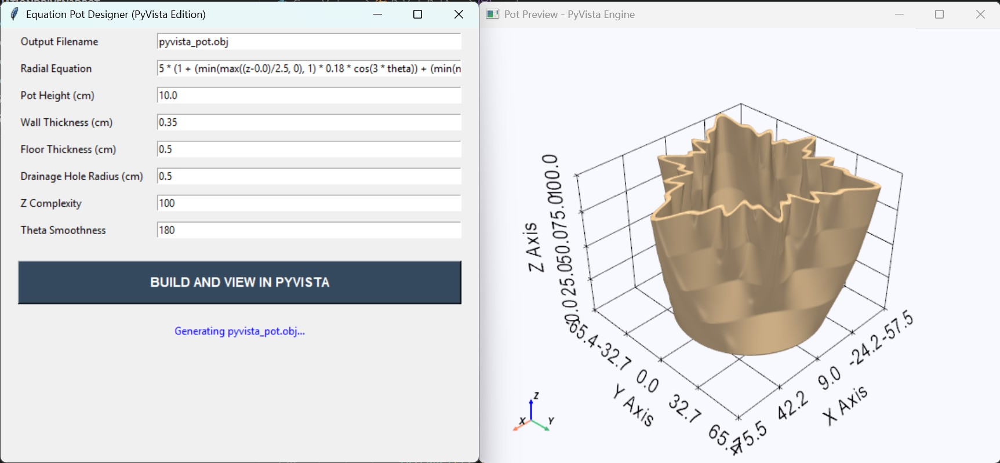
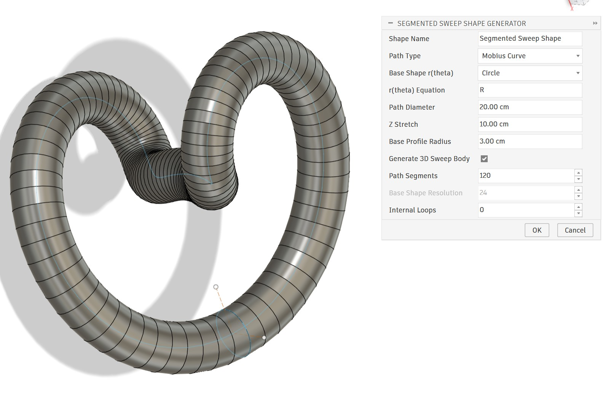
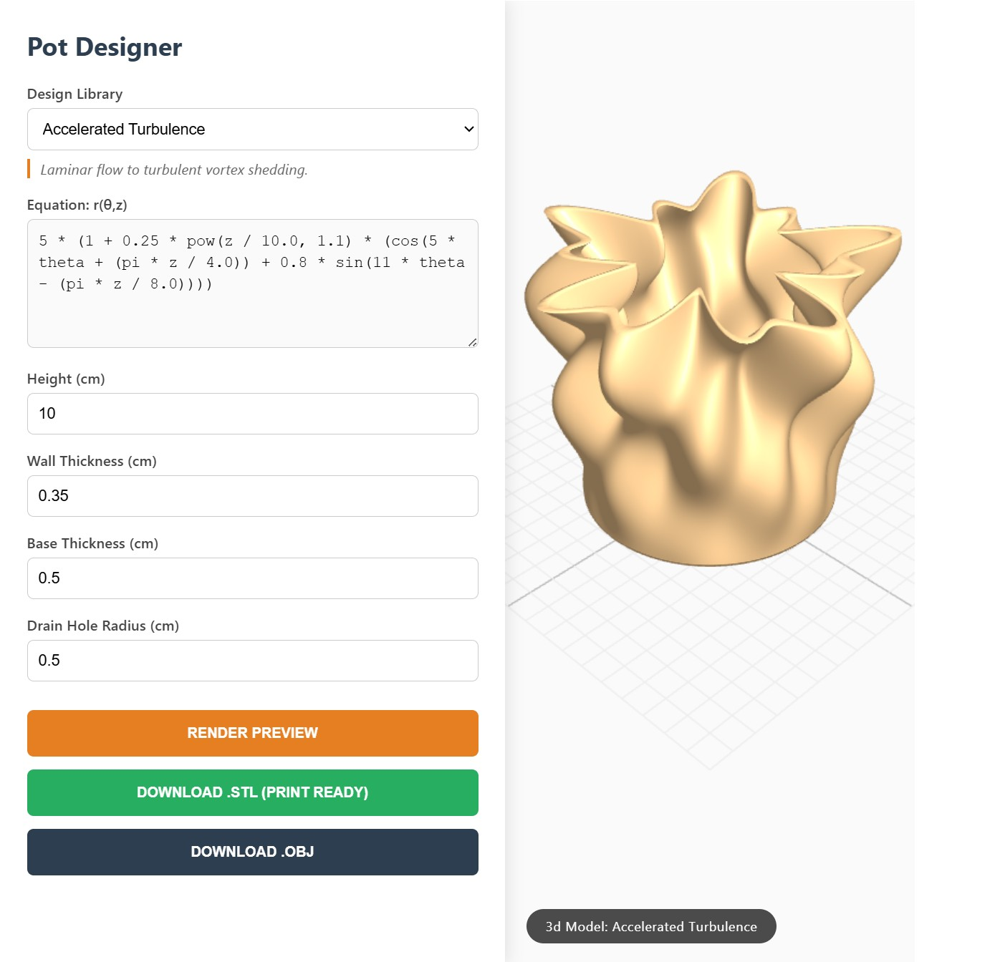
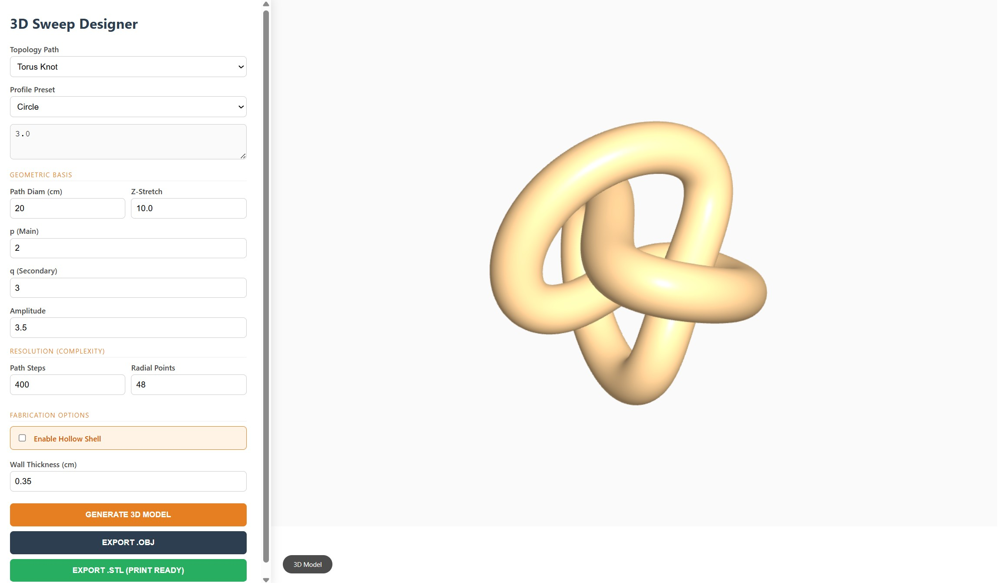
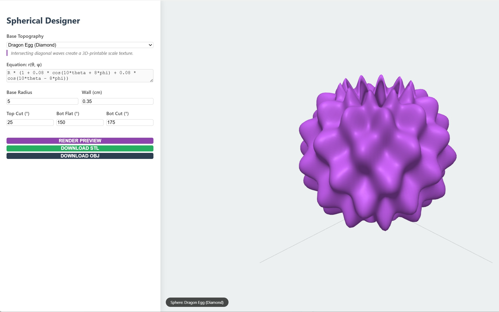
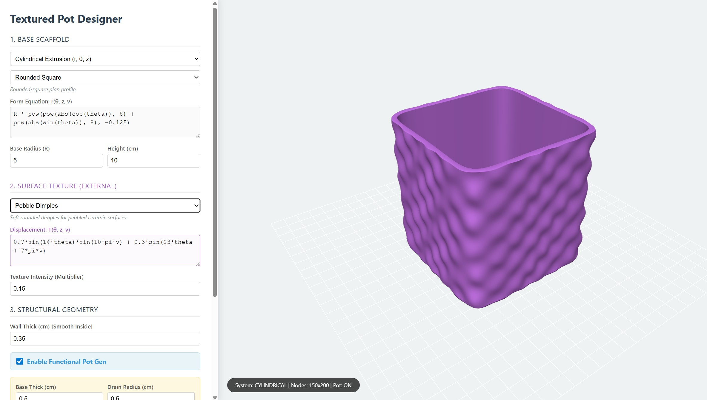
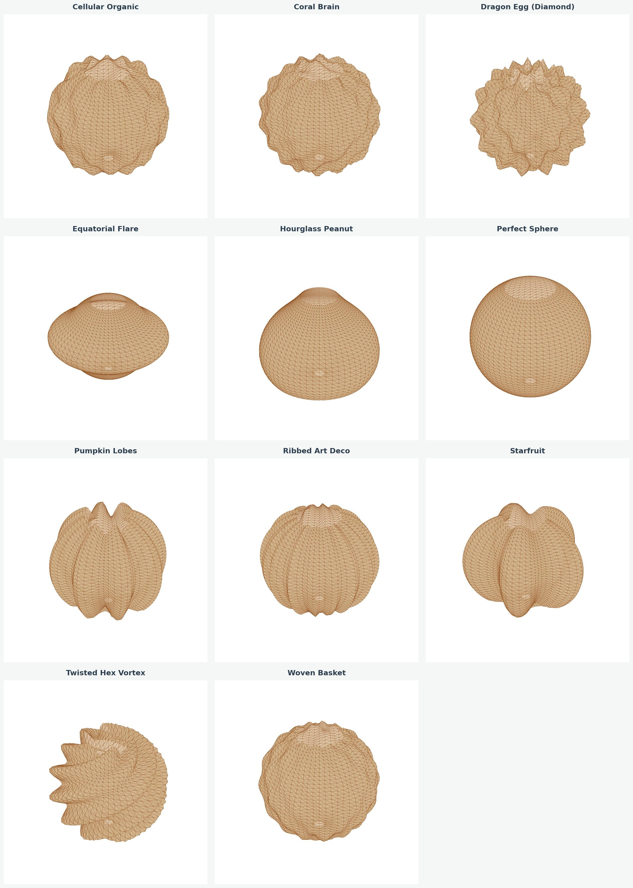

# Equation-Driven Pots

A project for generating functional 3D-printable plant pots from equations in cylindrical and spherical coordinates.

Instead of sculpting a pot manually, this project defines the surface mathematically through radius functions such as:

- `r(z, θ)` for cylindrical-coordinate pot generation
- `r(θ, φ)` for spherical-coordinate pot generation

where:

- `z` is the height along the vertical axis
- `θ` is the angle around the axis
- `φ` is the polar angle in spherical coordinates
- `r` is the radius at that position

The result is a printable hollow vessel generated directly from an equation. By changing the equation, you can create twisted, rippled, lobed, symmetric, or highly organic pot shapes while keeping the object functional for 3D printing.

---

## GUI preview

### PyVista GUI



### Fusion 360 MathSweep Studio



---

## HTML tool previews

### Pot Designer HTML



### 3D Sweep Designer HTML



### Spherical Pot Designer HTML



### Textured Unified Pot Designer HTML



---

## How it works

The code evaluates a user-defined equation over a sampled grid and converts that surface into printable geometry.

For cylindrical designs, the main form is defined by:

`r(z, θ)`

For spherical designs, the form is defined by:

`r(θ, φ)`

From that sampled surface, the tools generate printable geometry such as:

- an outer wall
- an inner wall
- a bottom surface
- a drainage hole
- a closed manifold mesh

The mesh is then exported as an `.obj` file, ready for inspection, slicing, and 3D printing.

---

## Features

- Generate pots from mathematical equations
- Support cylindrical and spherical equation-driven workflows
- Export printable OBJ meshes
- Control wall thickness, bottom thickness, height, and drainage hole size
- Explore different interfaces:
  - command-line generator
  - Tkinter GUI
  - Dash web GUI
  - PyVista preview GUI
  - browser-based HTML pot designer
  - browser-based HTML spherical pot designer
  - browser-based HTML sweep designer
  - Fusion 360 parametric sweep reconstruction script
  - Includes a browser-based unified textured pot designer with cylindrical and spherical modes
- Keep the repository lightweight by primarily hosting code and images, while example 3D models are hosted externally

---

## Getting started

### 1. Clone the repository

```bash
git clone https://github.com/arkadiraf/Equation-Driven-Pots.git
cd Equation-Driven-Pots
```

### 2. Create a Python environment

Recommended: Python 3.10 or newer

#### Windows

```bash
python -m venv .venv
.venv\Scripts\activate
```

#### macOS / Linux

```bash
python3 -m venv .venv
source .venv/bin/activate
```

### 3. Install packages

If you want everything installed:

```bash
pip install numpy dash plotly pyvista
```

> `tkinter` is usually included with standard Python installations.  
> On some Linux systems, you may need to install it separately with your package manager.

---

## Python scripts and required packages

### `Python/Equation Driven Pottery.py`

Basic command-line OBJ generator.

**Purpose**

- Generates a pot mesh directly from a hardcoded equation
- Exports a manifold OBJ file

**Required packages**

- No external packages
- Uses Python standard library only:
  - `math`
  - `dataclasses`

**Run**

```bash
python "Python/Equation Driven Pottery.py"
```

---

### `Python/Equation Driven PotteryGui.py`

Simple desktop GUI built with Tkinter.

**Purpose**

- Lets you enter the equation and dimensions in a form
- Exports the generated pot as an OBJ file

**Required packages**

- No external pip packages
- Uses Python standard library only:
  - `math`
  - `tkinter`
  - `dataclasses`
  - `os`

**Run**

```bash
python "Python/Equation Driven PotteryGui.py"
```

---

### `Python/GuipyVista.py`

Desktop GUI with PyVista-based 3D preview.

**Purpose**

- Generate the OBJ mesh
- Open a rendered preview in a PyVista viewer

**Required packages**

- External:
  - `pyvista`
- Standard library:
  - `math`
  - `tkinter`
  - `dataclasses`
  - `os`

**Install**

```bash
pip install pyvista
```

**Run**

```bash
python "Python/GuipyVista.py"
```

---

### `Python/GuiDash.py`

Browser-based interface using Dash and Plotly.

**Purpose**

- Enter an equation in a web app
- Preview the pot in 3D
- Export a higher-resolution OBJ file

**Required packages**

- External:
  - `numpy`
  - `dash`
  - `plotly`
- Standard library:
  - `math`
  - `os`
  - `dataclasses`
  - `pathlib`

**Install**

```bash
pip install numpy dash plotly
```

**Run**

```bash
python "Python/GuiDash.py"
```

Then open the local Dash address shown in the terminal.

---

### [`Python/Fusion360/3d MathSweep Studio.py`](./Python/Fusion360/3d%20MathSweep%20Studio.py)

Fusion 360 script for reconstructing equation-driven swept geometry directly inside Fusion.

**Purpose**

- Rebuild a 3D swept form in Fusion 360 from a mathematical path and a base profile
- Make the design easier to inspect, edit, and continue modeling as native Fusion geometry
- Provide a more CAD-friendly workflow than importing a mesh generated from the sweep designer

This tool is useful when the designer wants to reconstruct the 3D shape directly in Fusion 360 instead of importing the mesh file exported by the sweep designer. Working natively in Fusion makes it easier to continue editing, combining features, and adapting the result for downstream CAD work.

**How to add it in Fusion 360**

1. Open **Fusion 360**
2. Go to **Utilities**
3. Open **Add-Ins**
4. Open **Scripts and Add-Ins**
5. Click **+ New Script**
6. Copy or place `3d MathSweep Studio.py` into the created script folder
7. Return to **Scripts and Add-Ins**, select the script, and run it

**Notes**

- The script is heavier on Fusion 360 than the mesh-based workflow
- More complex profiles and higher section counts can noticeably slow generation
- The Fusion workflow is best when you want editable CAD geometry rather than a lightweight imported mesh

**Required packages**

- No external pip packages
- Runs inside Fusion 360's Python environment
- Uses Fusion API modules such as:
  - `adsk.core`
  - `adsk.fusion`
  - `math`
  - `traceback`

---

## HTML / JavaScript tools

### [`JavaScript/PotDesigner.html`](./JavaScript/PotDesigner.html)

Browser-based pot designer for creating printable 3D pots directly in HTML and JavaScript.

**Purpose**

- Works similarly to the Python pot generator
- Lets you adjust the pot equation and geometry in the browser
- Exports the generated design as OBJ or STL

---

### [`JavaScript/SphericalPotDesigner.html`](./JavaScript/SphericalPotDesigner.html)

Browser-based spherical-coordinate pot designer for creating printable pots from equations of the form `r(θ, φ)`.

**Purpose**

- Design pots using spherical coordinates instead of cylindrical coordinates
- Explore forms that are easier to describe with `r(θ, φ)` than with `r(z, θ)`
- Preview the generated shape directly in the browser
- Export the generated design for downstream 3D modeling and printing workflows

This tool extends the project beyond height-based radial pot design and opens up a broader design space for equation-driven vessels.

---

### [`JavaScript/SweepDesigner.html`](./JavaScript/SweepDesigner.html)

Browser-based 3D sweep designer for creating guided swept forms.

**Purpose**

- Lets you build more complex 3D swept shapes interactively
- Exports the generated design as OBJ or STL
- Can be used as a starting point for more intricate pot designs with additional work

---

### [`JavaScript/TexturedPotDesigner.html`](./JavaScript/TexturedPotDesigner.html)

Browser-based unified pot designer for creating printable pots from both cylindrical and spherical coordinate systems, with optional surface texture applied directly to the outer shell.

**Purpose**

- Combines cylindrical and spherical pot design into one interface
- Lets you switch between equation systems in a single tool
- Adds external texture displacement on top of the base pot form
- Previews the generated shape directly in the browser
- Exports the generated design as STL

**Texture variables**

The unified textured designer uses a base form equation together with a texture displacement equation.

The base form defines the main pot shape, and the texture equation adds or subtracts small surface offsets on the outside of the pot.

Common variables used in the tool:

- `r` — final radius of the surface at a point
- `T` — texture displacement amount; controls bumps, dimples, ridges, or engraving depth
- `θ` — angular position around the pot; useful for petals, ribs, symmetry, and repeating radial patterns
- `z` — height along the pot in cylindrical mode; useful for vertical transitions, rings, twists, and height-based shaping
- `φ` — polar angle in spherical mode; useful for describing curved vertical distribution on spherical forms
- `v` — normalized vertical position from `0.0` to `1.0`; useful for scaling textures consistently from bottom to top across both coordinate systems

Conceptually, the textured version behaves like:

`final radius = base radius + texture displacement`

This allows the tool to keep the overall pot form and the surface texture separate, so one equation controls the vessel shape while another controls the outer relief pattern.

---

## Example equations

A cylindrical pot can be generated from a radial function such as:

```python
5 * (1 + 0.22 * cos(5 * theta + pi * z / 10))
```

This defines the radius at each point along height and angle, producing a patterned surface that varies as the pot rises.

You can also build more layered forms using piecewise or frequency-mixed expressions such as:

```python
5 * (
    1
    + min(max((z-0.0)/2.5, 0), 1) * 0.18 * cos(3 * theta)
    + min(max((z-2.5)/2.5, 0), 1) * 0.15 * cos(6 * theta)
    + min(max((z-5.0)/2.5, 0), 1) * 0.10 * cos(12 * theta)
)
```

A spherical pot can be generated from an equation of the form:

```python
r(theta, phi)
```

which defines the radius as a function of azimuthal angle and polar angle.

---

## Pot equations

A collection of equations is available here:

[Pot Equations Spreadsheet](https://docs.google.com/spreadsheets/d/e/2PACX-1vRYxQRyGNsDuxl4WaNONKAniyfK-77zSTJY7q4plz88dK7fTNcIbU8814u9wOJ2o2BI10GwCpFbcP3U/pubhtml?widget=true&headers=false)

The spreadsheet includes both cylindrical and spherical equations.

---

## Gallery

### Cylindrical pot designs


### Spherical design summary



Example 3D models for the spherical designer are hosted on Thingiverse to keep the repository lightweight:

[Equation-Driven Pots on Thingiverse](https://www.thingiverse.com/thing:7327538)

---

## Main parameters

The generators expose several parameters that affect both geometry and printability:

- **Radial Equation** — the mathematical definition of the outer form
- **Pot Height** — total height of the object
- **Wall Thickness** — thickness of the vessel walls
- **Bottom Thickness** — thickness of the floor
- **Drainage Hole Radius** — size of the bottom hole
- **Z Sections** — vertical mesh resolution
- **Theta Sections** — angular mesh resolution / smoothness
- **Phi Sections** — polar sampling resolution for spherical designs

Higher section counts produce smoother meshes, but also larger files and slower generation.

---

## Output

The scripts and HTML tools export `.obj` files, and the HTML tools can also export `.stl` files.

These can be opened in tools such as:

- Blender
- MeshLab
- PrusaSlicer
- Cura
- other 3D modeling or slicing software

---

## 3D printing notes

For best results:

- keep wall thickness large enough for your nozzle and material
- avoid equations that produce negative or near-zero radii
- use higher angular resolution for sharp ripples or high-frequency patterns
- inspect the OBJ before slicing
- test small versions first before printing full-size pots

---

## Why this project?

Equation-Driven Pots turns mathematics into fabrication.  
It treats equations not just as descriptions, but as design tools for producing real, usable objects. This makes it possible to explore procedural form, computational design, digital fabrication, browser-based interactive design, and CAD reconstruction in a simple workflow.

---

## Optional AI-assisted direct generation

In addition to the Python and HTML tools in this repository, you can also use AI to generate a 3D pot mesh directly.

**AI workflows**

- Feed the Python pot-generation scripts to a capable AI model
- Use the included prompt file: [`3dPotGenerator.txt`](./3dPotGenerator.txt)

**Tested with**

- Gemini Thinking mode
- ChatGPT Thinking mode

The prompt-based workflow instructs the model to generate and run Python code that creates a printable `.obj` file, produces a preview image, and returns a downloadable result.

This is useful if you want a fast, portable workflow for one-off pot generation without manually editing the scripts first.

> This prompt-based workflow is experimental and may produce inconsistent results depending on the model, version, and run.

---

## License

This repository is licensed under GPL-3.0.
